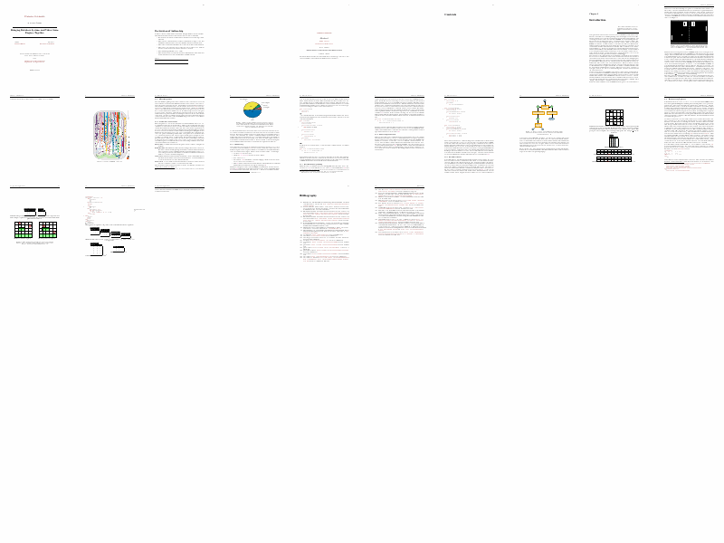

Saw [this tweet](https://twitter.com/realscientists/status/1369995661253480450) and thought it was cool. The code used to produce the video was not made public, so I whipped something up myself.

# WARNING
This tool internally uses `git checkout --force` to deal with files that may be produced between compilation steps. Absolutely **do not** use this tool on your live repository! Instead, do a clean checkout of your repository to a temporary directory or copy your entire local repository and run this tool on there. I take no responsibility for any broken repositories. 😛

# How does it work?
This utility checks out all revisions of a specified repository, runs a specified compilation command (`make`, `pdflatex`, whatnot) to generate your PDF file and renders all pages onto a blank image. The images can then be concatenated into a GIF.

# Setup
Requires python3. I use `PIL` to render the frames, so I am not entirely sure how well this utility runs outside of Linux.


```
pip install -r requirements.txt
```

To install all dependencies.

# Running
To list all available switches, run:

```
python main.py -h
```

An example usage would be:

```
python3 main.py --command "make" --repository "/tmp/CopyOfMyPaperRepository" --pdfpath "/tmp/CopyOfMyPaperRepository/output/paper.pdf" --gifpath "movie.gif" --subdirectory "doc" --starthash "8847d7cd664ba98b0dea375e4cb9847fb1afccc3"
```

The above command will expect a valid git repository at `/tmp/CopyOfMyPaperRepository`. It will change the directory to `/tmp/CopyOfMyPaperRepository/doc`, since the `--subdirectory` was specified. Each revisions, starting from `8847d7cd664ba98b0dea375e4cb9847fb1afccc3`, will be checked out and compiled using `make`. The resulting images are then put together in a GIF called `movie.gif`.


